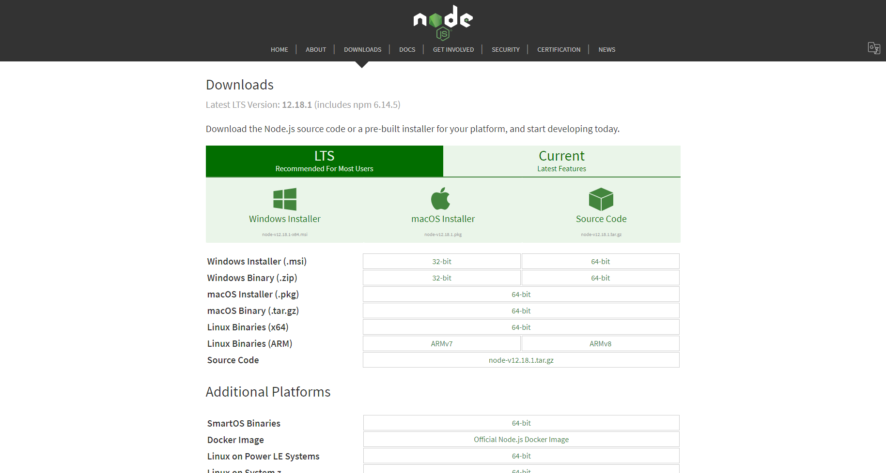
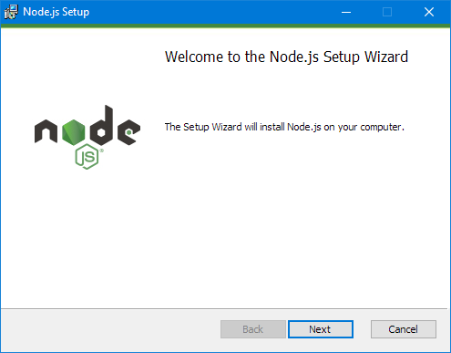
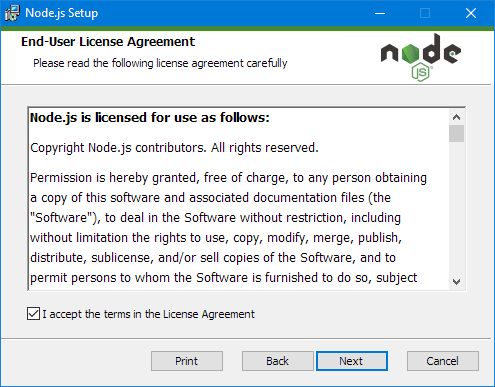
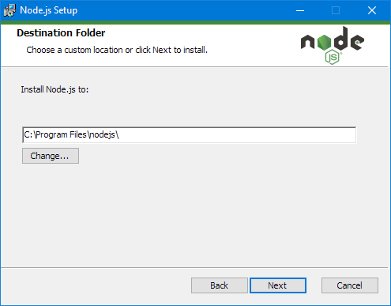
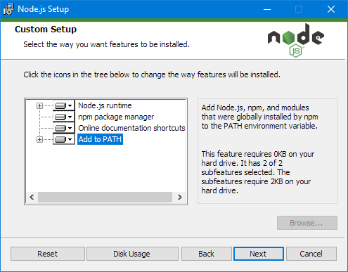
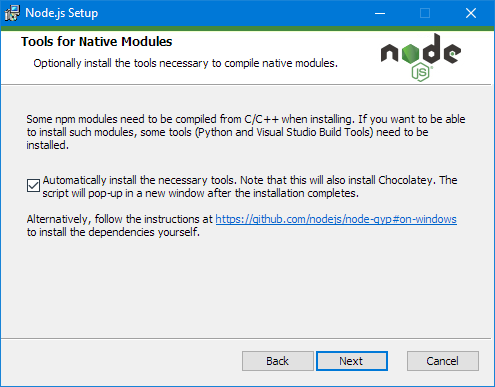
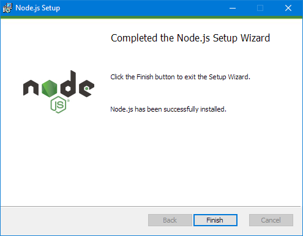
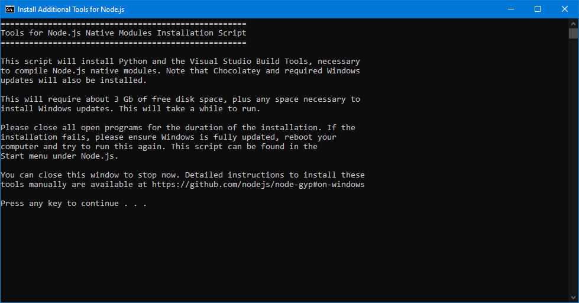
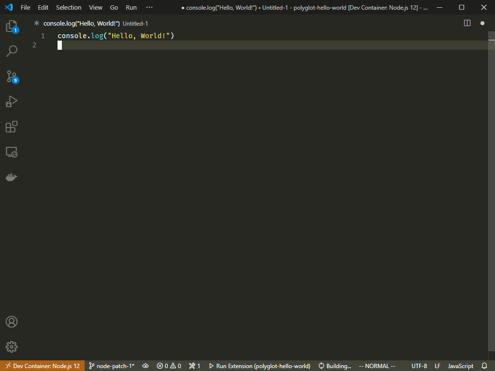

# Node.js Installation Guide
Follow this guide to install
Node version `12.18.1`.

First, go to the official Node.js website
to download Node installation package.

<https://nodejs.org/en/download/>

- Run the downloaded `node-v12.18.1-x64.msi` file.

- Make sure you have "Automatically install the necessary tools"
checkbox **checked**.

- After the installation script is finished,
you will be prompted to install "necessary tools".
Press any key to proceed. This step can take
several minutes.

# Node.js Hello World!

- Create a new file named `main.js`.
- Open the created file in Visual Studio Code.
- Write the following code in the editor.

- Save the file.
-Press `F5` key to run the hello world script.
