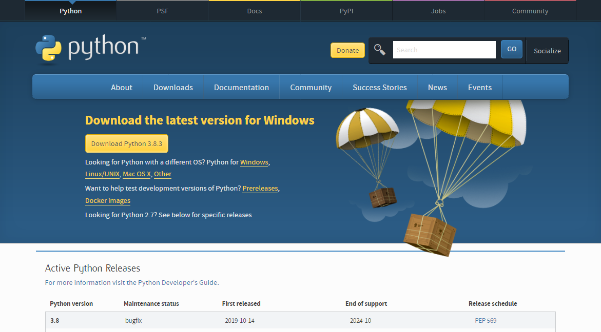
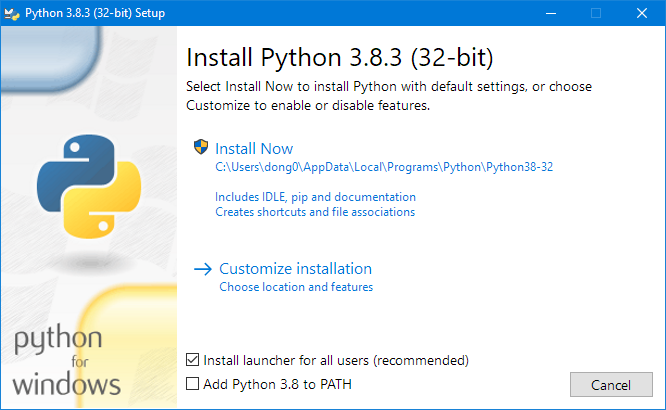
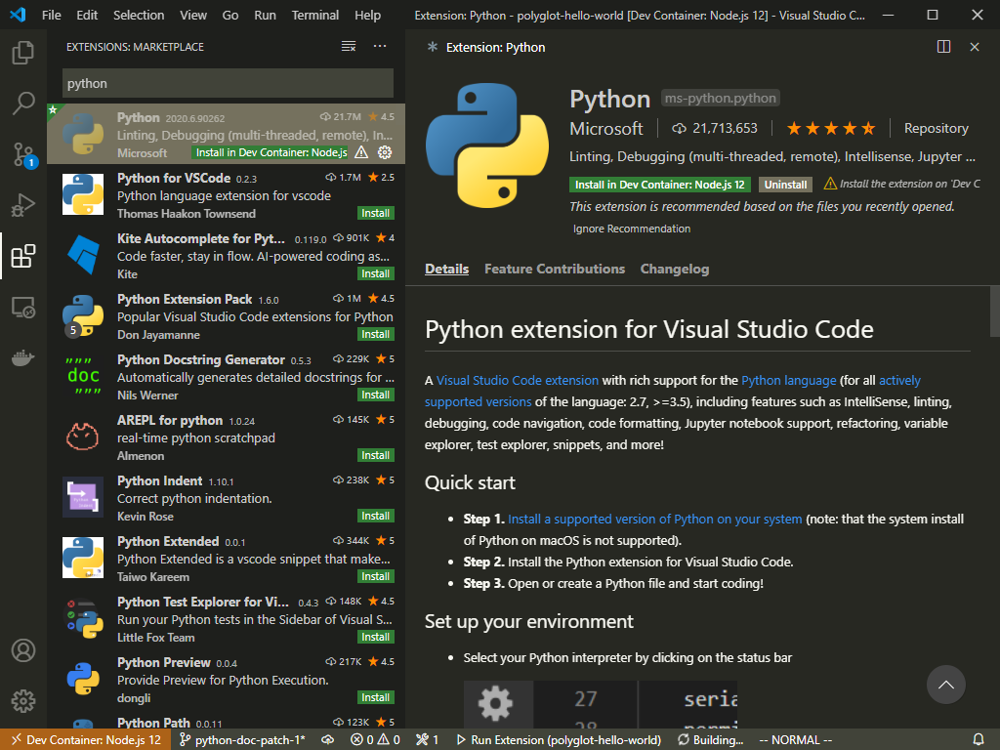
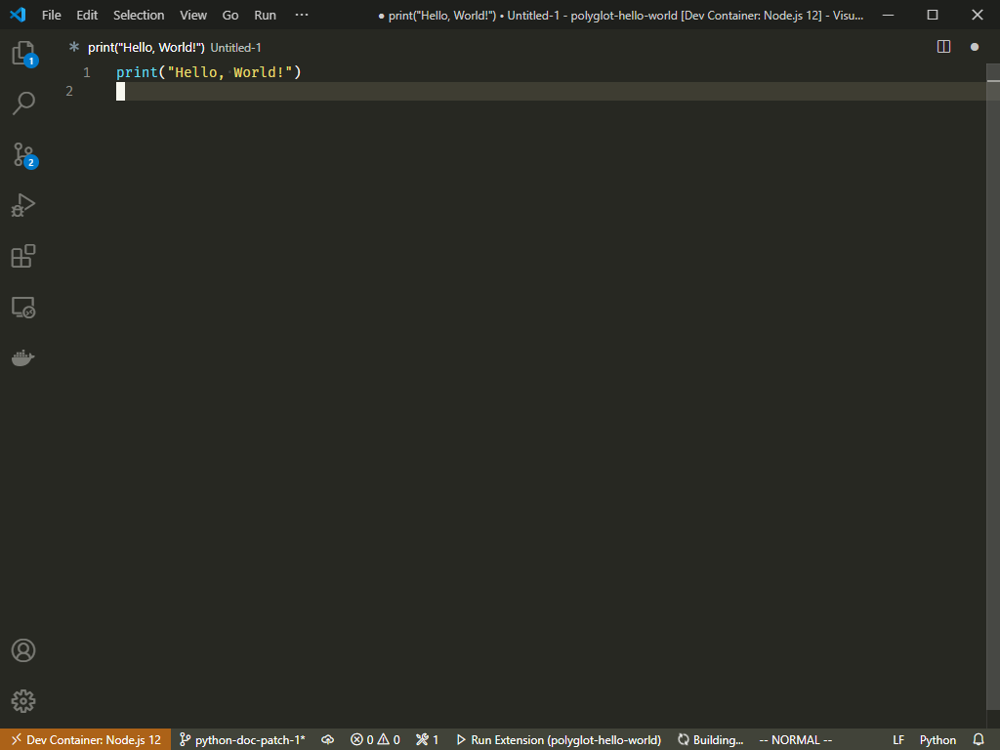

# Python Installation Guide (Windows)
Follow this guide to install
Python version `3.8.3`.

First, go to the official Python website
to download Python installation package.

<https://www.python.org/downloads/>

- Run the downloaded `python-3.8.3.exe` file.

- Make sure you have "Add Python 3.8 to PATH" checkbox **checked**.

- Click on **Install Now** button and proceed with the
installation dialog.

- Close the installation dialog when Python is successfully installed.

# Python Extension for Visual Studio Code

- Open extensions tab inside visual studio code.
- Search for `Python`.
- Press install button for Python extension.

# Python Hello World!

- Create a new file named `main.py`.
- Open the created file in Visual Studio Code.
- Write the following code in the editor.

- save the file.
- Press `F5` key to run the hello world script.
