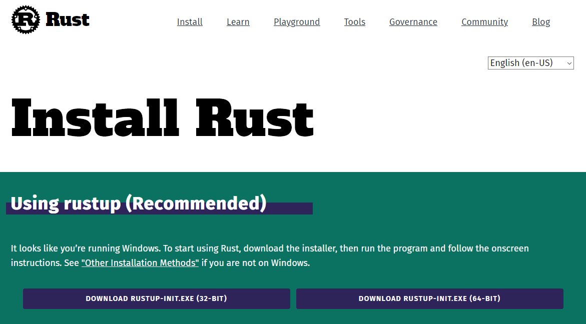
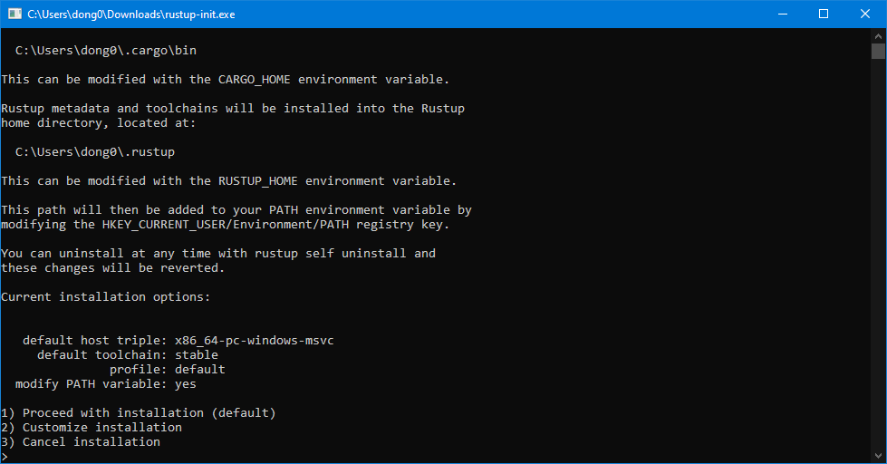
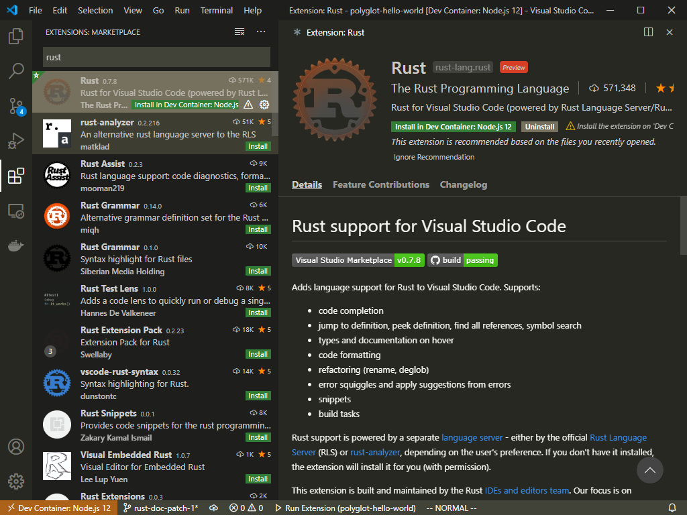
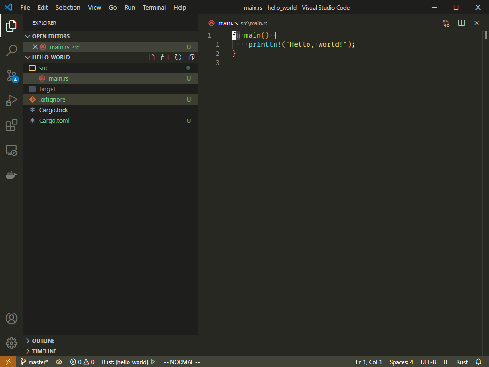
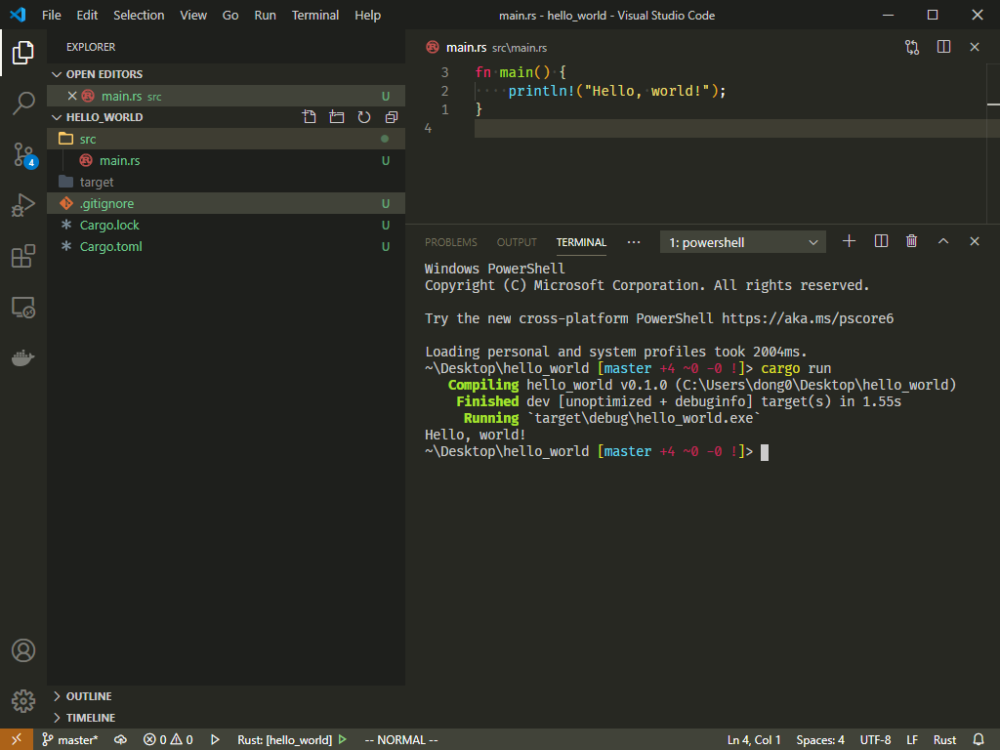

# Rust Installation Guide (Windows)
Follow this guide to install
latest version of Rust.

First, go to the official Rust website
to download `rustup` tool.

<https://www.rust-lang.org/tools/install>



- Run the downloaded `rustup-init.exe` file.



- Press 1 and proceed with the default installation.

# Rust Extension for Visual Studio Code

- Open extensions tab inside Visual Studio Code.
- Search for `Rust`.
- Press install button for Rust extension.



# Rust Hello World!

- Run the following command in terminal
to start a new Rust project called `hello_world`.
```
cargo new hello_world
```
- Open the newly created `hello_world` folder inside
Visual Studio Code.

- When Visual Studio Code has finshed opening the folder,
explore to `src/main.rs` and double click on it.



- Open up a terminal panel, and run the following command
to run our first Rust program.
```
cargo run
```


